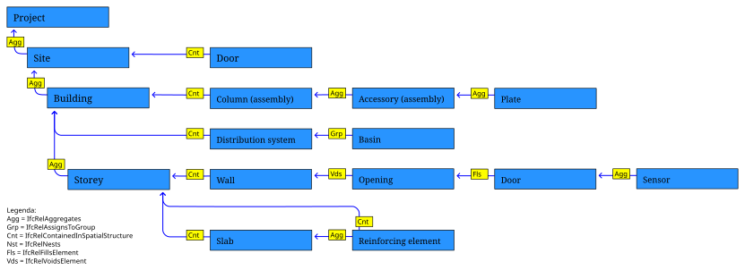

# 構造(PartOf)ファセット

このファセットは、他のオブジェクトの一部である（適用対象）オブジェクトを特定するか、それらがそうである必要がある（要求条件）ことを要求します。

IFCのオブジェクトは他のオブジェクトと複数の関係を持つことができますが、IDS構造は、あるエンティティが別のエンティティの一部であるかどうかを判断するために、以下の型を再帰的にナビゲートします：

- **IFCRELAGGREGATES** 関係は、複数の小さなサブオブジェクトを単一の大きなオブジェクトに集約する方法を説明します。例えば、多くの建物階層が建物を構成します。または、多くの梁、床板、接合部がスラブを構成します。あるいは、多くのブラケット、方立、鋼板がアセンブリを構成する場合もあります。
- **IFCRELASSIGNSTOGROUP** 関係は、複数のオブジェクトを任意の用途のオブジェクトのコレクションにグループ化する方法を説明します。例えば、ダクト、AHU、ファン、ルーバーはすべて単一の配給システムにグループ化される場合があります。または、ケーブル、配電盤、GPOが単一の回路にグループ化される場合があります。あるいは、スペースがゾーンにグループ化されたり、保守可能な資産がインベントリにグループ化されたりする場合もあります。
- **IFCRELCONTAINEDINSPATIALSTRUCTURE** 関係は、複数のオブジェクトを特定の場所に配置する方法を説明します。例えば、ポンプがスペース内にあったり、柱が2階建物階層にあったり、街路設備が建物敷地にあったりする場合があります。IFCでは、すべてのオブジェクトは単一の主要な位置コンテナを持つ必要があります。複数の場所で参照される場合（複数階にまたがる柱など）でも同様です。この関係は主要な位置コンテナのみを対象とします。
- **IFCRELNESTS** 関係は、物理的なオブジェクトが、通常は事前に開けられた穴や接続端子などの物理的な接続を通じて、より大きなホストオブジェクトに接続される方法を説明します。ホストが移動すると、取り付けられたネストされたオブジェクトも一緒に移動します。
- **IFCRELVOIDSELEMENT** 関係は、voidが要素に属する方法を説明します。
- **IFCRELFILLSELEMENT** 関係は、要素がvoidを埋める方法を説明し、それをvoidの一部にします。

`relation`パラメータが指定されていない場合、包含エンティティを特定するために6つすべてが（再帰的に）考慮されます。そうでない場合は、指定された関係型のみが（再帰的に）考慮されます。

## パラメータ

| パラメータ     | 必須 | 型            | 許可値                                                  | 意味                                                                                                                                                                                           |
| ------------ | ---- | --------------- | --------------------------------------------------------------- | ------------------------------------------------------------------------------------------------------------------------------------------------------------------------------------------------- |
| **Entity**   | ✔️ | エンティティファセット | 任意の有効なIDS`entityType`、XMLにネストされている（例：「IFCSYSTEM」）                         | より大きなオブジェクトのIFCクラスが要求されたエンティティと一致する。                                                                                                                                   |
| **Relation** | ❌ | 文字列          | 上記にリストされた6つのサポートされた型から選択された1つの関係 | 省略された場合、直接的または間接的、かつ推移的（再帰的）に評価される必要がある任意の有効なIFC関係構造、指定された場合は指定された型のみが（再帰的に）評価される必要がある |

## 例

| 適用対象の意図                                          | 要求条件の意図                                        | ファセット定義                                                |
| ---------------------------------------------------------------- | ------------------------------------------------------------ | --------------------------------------------------------------- |
| カーテンウォールを直接構成する任意のエンティティ             | エンティティ（例：方立）はカーテンウォールの一部である必要がある     | Relation="IFCRELAGGREGATES", Entity="IFCCURTAINWALL"            |
| カーテンウォールの直接的または間接的な一部である任意のエンティティ | エンティティ（例：方立）はカーテンウォールの一部である必要がある     | Entity="IFCCURTAINWALL"                                         |
| 配給システムの一部である任意のエンティティ                 | エンティティ（例：ダクト）は配給システムの一部である必要がある | Relation="IFCRELASSIGNSTOGROUP", Entity="IFCDISTRIBUTIONSYSTEM" |
| スペースに配置されている任意のエンティティ                            | エンティティ（例：ポンプ）はスペースに配置されている必要がある            | Relation="IFCRELCONTAINEDINSPATIALSTRUCTURE", Entity="IFCSPACE" |
| 壁によってホストされている任意のエンティティ                              | エンティティ（例：窓）は壁に固定されている必要がある             | Relation="IFCRELNESTS", Entity="IFCWALL"                        |