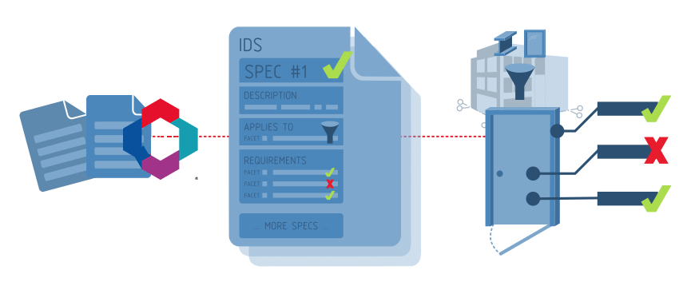

# Specification(要件) はどのように機能するか？

**Specification(要件)** は、人間が理解しやすいように設計されています。
しかし、**Specification(要件)** はまた、コンピューターソフトウェアが曖昧さなく情報要求を自動的かつ正確にチェックできるように、高度に構造化されています。
すべての **Specification(要件)** には3つの主要な部分があります：

1. **Description(説明)** ：**Specification(要件)** の根拠と、それを達成する方法の説明。
  この部分は、人間が読んで理解し、なぜ情報が要求されているかを理解するために設計されています。

  このフィールドは、さまざまな適用対象のファセットの根拠を説明し、それらがアセット全体の関連するデータ契約を個別にではなく、どのように識別するかを説明するためにも使用されます。逆に、各要求条件のファセットの `description` データは、ユーザーが要求される個別の情報の目的を理解するのに役立ちます。

1. **Applicability(適用対象)** ：指定しようとしているモデルのサブセットを識別します。
  IFCモデルには多くの異なるタイプのオブジェクトがありますが、各 **Specification(要件)** はサブセットにのみ適用されます。
  サブセットは、エンティティ（例：壁、窓）、分類（例：Uniclass EF_25_10_25 外壁）、およびその他の利用可能なファセットを通じて識別できます。
1. **Requirements(要求条件)** ：適用対象で識別されたサブセットに必要な情報、例えば必要なプロパティや材料。

例えば、「_すべての壁には防火等級プロパティが必要_」という **Specification(要件)** は次のように構造化されます：

 1. **Description(説明)** ：壁の防火等級は建築基準法の遵守に重要
 1. **Applicability(適用対象)** ：この仕様はすべての壁オブジェクトに適用される
 1. **Requirements(要求条件)** ：前述の壁オブジェクトには防火等級プロパティが必要

## Specification(要件) が情報をどのように記述するか

**Applicability(適用対象)** と **Requirements(要求条件)** は、**ファセット** のコレクションを使用して記述されます。**ファセット** は、モデル内の単一のエンティティ（例：壁、ドア等）が持つ可能性のある情報を記述します。
**ファセット** は、固定された **ファセットパラメーター** を使用して情報を正確に記述するため、コンピューターがどのような情報を求めているかを正確に理解できます。

**ファセット** が **Applicability(適用対象)** セクションで使用される場合、モデルの関連部分を識別するために使用する情報を記述します。

**ファセット** が **Requirements(要求条件)** セクションで使用される場合、モデル部分が **Specification(要件)** に準拠するために満たさなければならない情報制約を記述します。



情報の6つの異なる **ファセット** があります：

| ファセットタイプ | ファセットパラメーター | 適用対象の例 | 要求条件の例 |
| ------------------ | ----------------------------------------- | -------------------------------------------------------------------------------------------------------- | -------------------------------------------------------------------------------------- |
| **Entity** | **IFC Class** と **Predefined Type** | 事前定義タイプが"SHEAR"の"IfcWall"に適用される | 事前定義タイプが"SHEAR"の"IfcWall"でなければならない |
| **Attribute** | **Name** と **Value** | 属性"Name"の値が"W01"の要素に適用される | 属性"Name"の値が"W01"でなければならない |
| **Classification** | **System** と **Value** | "Uniclass 2015"の下で"EF_25_10_25"として分類された要素に適用される | "Uniclass 2015"分類参照が"EF_25_10_25"でなければならない |
| **Property** | **Property Set**、**Name**、**Value** | プロパティセット"Pset_WallCommon"の"LoadBearing"プロパティが"TRUE"に設定された要素に適用される | プロパティセット"Pset_WallCommon"の"LoadBearing"プロパティが"TRUE"に設定されていなければならない |
| **Material** | **Value** | "concrete"要素に適用される | "concrete"材料を持たなければならない |
| **Parts** | **Entity** と **Relationship** | "IfcSpace"に"contained in"の関係にある要素に適用される | "IfcSpace"に"contained in"の関係になければならない |

**Applicability(適用対象)** または **Requirements(要求条件)** セクションで複数の **ファセット** を組み合わせて、さまざまな **Specification(要件)** を記述できます。
一部の **ファセット** には、オプションの **ファセットパラメーター** があります。
例えば、プロパティが存在すべきだが、正確な値は指定しない場合は、**Property Facet** の値パラメーターを省略できます。

一部の **ファセットパラメーター** には、有効な値のリスト、数値の範囲、またはテキストパターンを指定することもできます。これらは **複合制限** として知られています。
例えば、防火等級プロパティが"0HR"、"1HR"、または"2HR"の値のみから選択しなければならないことを指定するには、**複合制限** を使用します。

以下に、興味を引くためのいくつかの例を示します：

| 意図 | Applicability(適用対象) | Requirements(要求条件) |
| ----------------------------------------------------------------------------------- | -------------------------------------------------------------------------------------------------------------------------------------------------------------------------- | ---------------------------------------------------------------------------------------------------------------------------------------------------------------------------------------------------------------------------------------------- |
| 外部の構造壁は、法令遵守のために防火等級プロパティを持つ必要がある | <ul><li>**Entity Facet** (**IFC Class** は IfcWall)</li><li>**Property Facet** (**Property Set** は Pset_WallCommon、**Name** は LoadBearing、**Value** は TRUE)</li></ul> | <ul><li>**Property Facet** (**Property Set** は Pset_WallCommon、**Name** は FireRating)</li></ul> |
| 寝室は最小10m2の面積を持つべき | <ul><li>**Entity Facet** (**IFC Class** は IfcSpace)</li><li>**Attribute Facet** (**Description** は "BEDROOM" のテキストを含む)</li></ul> | <ul><li>**Property Facet** (**Property Set** は Qto_SpaceBaseQuantities、**Name** は NetFloorArea、**Value** は >= 10)</li></ul> |
| すべてのレンガ壁タイプは分類され、承認された命名規則に従わなければならない | <ul><li>**Entity Facet** (**IFC Class** は IfcWallType)</li><li>**Material Facet** (**Value** は brick)</li></ul> | <ul><li>**Classification Facet** (**System** は Uniclass 2015、**Value** は EF_25_10 で始まる)</li><li>**Attribute Facet** (**Name** は Name、**Value** は文字"WT"の後に2桁の数字、例：WT01、WT02など)</li></ul> |

各 **ファセット** が指定できる情報の全機能については、以下のセクションで詳細を参照してください。

## 多重度

### 適用対象エンティティの多重度

各 **Specification(要件)** は、適用対象基準に一致するモデルのサブセットが **Required**、**Optional**、または **Prohibited** であることを定義します。
次のような例を考えてみましょう：

```txt
applicability =  Type = walls
                 Property = IsExternal
requirement   =  Property = FireRating
```

以下の解釈が適用されます：

| minOccurs | maxOccurs | 解釈 | 意味 |
| --------- | --------- | -------------- | ---------------------------------------------------------------------------------------------------------------------------------- |
| 1 | unbounded | **required** | IsExternal プロパティを持つ少なくとも1つの壁が IFC モデルに見つかる _必要があり_ 、そのような各壁には防火等級プロパティが必要 |
| 0 | unbounded | **optional** | IsExternal プロパティを持つ壁はモデルでは _オプション_ 、そのような壁が存在する場合、すべて防火等級プロパティを持つ必要がある |
| 0 | 0 | **prohibited** | IsExternal プロパティを持つ壁はモデルに見つかってはならない、要求条件はモデルの検証で無視される |

### 要求条件の多重度

個別の要求条件ファセットも、それらが **Required**、**Optional**、または **Prohibited** であるかを指定できます。

次のようなプロパティの例を考えてみましょう：

```txt
Requirement 1: Property
    propetySet: ePset_SpaceOMA
    property: TravelDirection
    datatype: IFCLABEL
```

以下の解釈が適用されます：

| タイプ | 意味 | 成功基準 |
| -------------- | ------------------------------------------------------------------------------------- | --------------------------------------------------------------------------------------------------------- |
| **required** | モデルに一致するプロパティが必要 | 一致するエンティティは、IFCLABEL タイプで null でない値の ePset_SpaceOMA/TravelDirection プロパティを持つ |
| **prohibited** | モデルに一致するプロパティが存在してはならない | 一致するエンティティは、ePset_SpaceOMA プロパティセットに TravelDirection プロパティを持たない |
| **optional** | プロパティセット/プロパティと値制約の期待値が定義されているが、オプション | 一致するエンティティは、プロパティを持たないか、持つ場合は期待されるデータタイプと値である |

完全な例として、耐力壁であることが **Prohibited** である壁エンティティに適用される **Required** 仕様を持つことができます。これは、モデルに耐力壁を含ませたくない場合です。

## IFC スキーマサポート

各 **Specification(要件)** は、それが適用される IFC スキーマを定義します。サポートされる IFC スキーマは：

- IFC4X3_ADD2
- IFC4
- IFC2X3

IDS は、提供される IFC モデルが有効なデータのみを含むことを前提としています。モデルに構文エラーや IFC スキーマ検証エラーがある場合、モデルを検証できない可能性があります。
作成される IFC が有効であることを確認するのは、IFC オーサリングソフトウェアの責任です。

## 制限事項

IDS の最初のバージョンは、すべての分野に共通する IFC の基本的な情報と関係を対象としています。
より高度な情報要求は、現在 IDS の範囲外です。
例えば、ジオメトリチェック、計算された値や動的値に依存するチェック、IFC モデル外のデータを参照するチェック、またはドメイン固有の IFC 関係の使用は不可能です。

以下は、監査に他のツールが必要な高度な要求の例です：

- 構造梁と配管の間に干渉があってはならない
- すべての壁は敷地境界から3m離れている必要がある
- すべてのオフィススペースの合計面積は300m2を超えなければならない
- すべてのドアタイプの名前は一意でなければならない
- すべてのポンプには指定されたサプライヤーと製造業者が必要
- すべての空調機器にはトリガーイベントを持つセンサーを割り当てる必要がある
- 土曜日と日曜日はすべての作業スケジュールで祝日でなければならない
- すべてのモデルは主要なソフトウェアベンダーで3分以内に読み込まれなければならない
- モデル内の関連図面は CDE の最新リビジョンと一致する必要がある
- すべての鉄筋はパラメトリック掃引ディスクとしてモデル化すべき
- モデルは建設の竣工状態と一致する必要がある